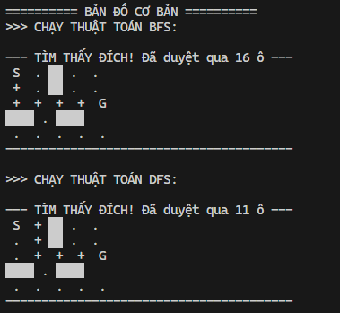
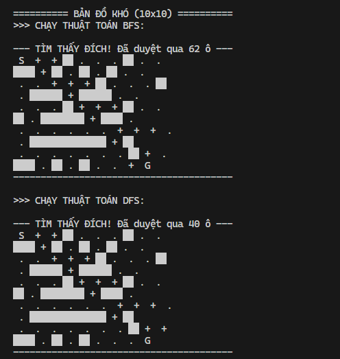

# Bài Lab Trí tuệ Nhân tạo: Robot Cứu hộ PCCC 🚒

Trong bài lab này, em thực hiện mô phỏng bài toán tìm đường cho Robot cứu hộ trong một tòa nhà bị cháy. Robot cần tìm đường từ vị trí bắt đầu (**Start - S**) đến vị trí nạn nhân (**Goal - G**) trong một mê cung có vật cản.

Bài toán được giải bằng hai thuật toán tìm kiếm mù:

- **BFS (Breadth-First Search)** – Tìm kiếm theo chiều rộng
- **DFS (Depth-First Search)** – Tìm kiếm theo chiều sâu

## 🎯 Mục tiêu

- Hiểu cách hoạt động của BFS và DFS
- Cài đặt thuật toán bằng Python
- So sánh hiệu năng của hai thuật toán
- Quan sát sự khác nhau về số lượng node đã duyệt

## 📁 Cấu trúc thư mục

Searching_in_the_state_space/
│
├── maps/
│ ├── maze_basic.py # Bản đồ đơn giản 5x5
│ └── maze_hard.py # Bản đồ khó 10x10
│
├── src/
│ ├── bfs_solver.py # Thuật toán BFS
│ ├── dfs_solver.py # Thuật toán DFS
│ ├── core_logic.py # Hàm hỗ trợ
│ └── main.py # File chạy chương trình
│
└── README.md

---

## ⚙️ Mô tả bài toán

- Mê cung được biểu diễn bằng ma trận 2 chiều
- Ký hiệu:
  - `S`: Điểm bắt đầu
  - `G`: Điểm đích
  - `0`: Đường đi
  - `1`: Tường / vật cản

Robot có thể di chuyển theo 4 hướng:

- Lên
- Xuống
- Trái
- Phải

---

## 🚀 Cách chạy chương trình

Mở terminal tại thư mục gốc và chạy:

```bash
python -m src.main
```

## 🔍 So sánh BFS và DFS

Tiêu chí BFS DFS
Đường đi Ngắn nhất Không đảm bảo
Bộ nhớ Tốn hơn Ít hơn
Cách duyệt Theo lớp Theo chiều sâu

## 📌 Nhận xét

BFS phù hợp khi cần tìm đường đi ngắn nhất
DFS phù hợp khi cần tiết kiệm bộ nhớ
Thứ tự duyệt các hướng ảnh hưởng đến kết quả của DFS

## Kết quả




